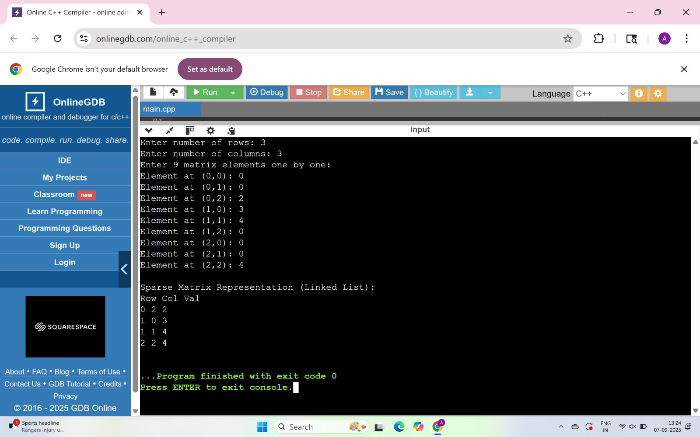

# linked-list-implementation
## PROBLEM
  LINKDLIST IMPLEMENTAION USING C++

  ## Reflection
**How long did you spend on this assignment?**  
~30–45 minutes, including refreshing arrays and maps.

**Based on your effort, what letter grade would you say you earned?**  
A  

**Based on your solution, what letter grade would you say you earned?**  
A  
**Summary of what doesn’t work / where I struggled** 

COMPALATION ERROS  WHILE CODING

## Execution proof
Below are screenshots showing that the program complied and executed successfull :
### Screenshot 1: Code and Program Output  

